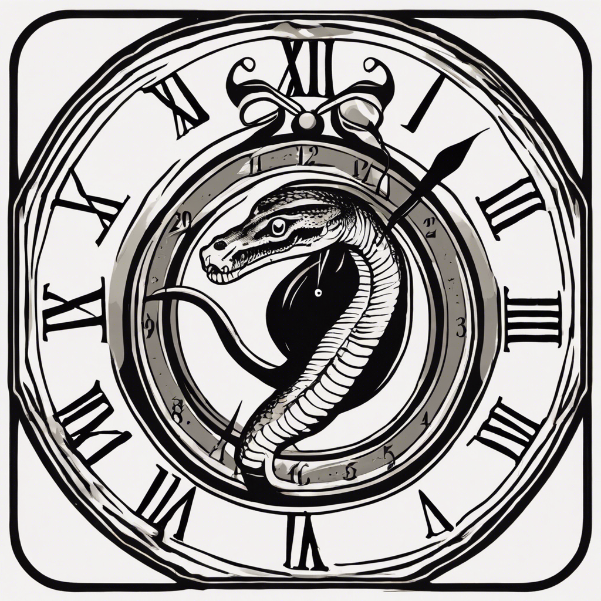

# DESimPy
Event-driven [discrete event simulation](https://en.wikipedia.org/wiki/Discrete-event_simulation) in Python (DESimPy).



## Overview

DESimPy is an event-driven simulation framework based on standard Python and inspired by [SimPy](https://simpy.readthedocs.io/en/latest/).

Processes in DESimPy are defined by methods owned by Python objects inherited from the `Event` abstract base class. These processes can be used to model system-level or component level changes in a modelled system. Such systems might include customers or patients flowing through services, vehicles in traffic, or agents competing in games.

DESimPy implements time-to-event simulation where the next event in a schedule is processed next regardless of the amount of time in the simulated present to that event. This constrasts with "time sweeping" in which a step size is used to increment foreward in time. It is possible to combine time-to-event with time sweeping (see [Palmer & Tian 2021](https://www.semanticscholar.org/paper/Implementing-hybrid-simulations-that-integrate-in-Palmer-Tian/bea73e8d6c828e15290bc4f01c8dd1a4347c46d0)), however this package does not provide any explicit support for that.

## Installation

```bash
pip install desimpy
```

## Quickstart

```python
from typing import NoReturn

from desimpy import core


class StartParking(core.Event):
    """Make the car park."""

    def execute(self, env) -> NoReturn:
        """Start parking and schedule next drive."""

        print(f"Start parking at {env.now}")

        scheduled_driving_time = env.now + 5

        driving_event = StartDriving(scheduled_driving_time)

        env.schedule_event(driving_event)


class StartDriving(core.Event):
    """Make the car drive."""

    def execute(self, env) -> NoReturn:
        """Start driving and schedule for next parking."""

        print(f"Start driving at {env.now}")

        scheduled_parking_time = env.now + 2

        parking_event = StartParking(scheduled_parking_time)

        env.schedule_event(parking_event)


class CarSimulation:
    """Our car simulation."""

    def __init__(self) -> NoReturn:
        self.simulation = core.Environment()

    def run_simulation(self) -> NoReturn:
        arrival_event = StartParking(0)
        self.simulation.schedule_event(arrival_event)
        self.simulation.run(15)


if __name__ == "__main__":
    example = CarSimulation()
    example.run_simulation()
```
